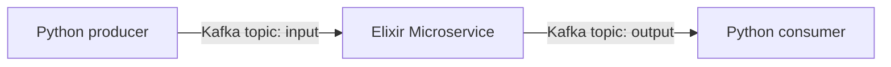

# Reactive microservices

This application is made to build Elixir reactive (micro?)services consuming and producing messages from and to Kafka topics.
The first flow is the simplest one:



Preliminary results shows that 8.000.000 messages of around 1 byte can be treated in around ~73 seconds for a throughput of >100k messages per second on a 8-CPU single machine without CPU usage spikes (*needs to be properly measured*)

Improved versions of this flow may encapsulate:

- [ ] Message of differents nature (binary, JSON,...) and size.
- [ ] Multiples microservices build inside the same Erlang release
- [ ] Messages flowing between microservices using message passing and GenServers vs. Kafka topics.
- [ ] Full monitoring using the [telemetry](https://www.erlang-solutions.com/blog/introducing-telemetry/) app

## Start the Kafka broker

```bash
docker compose up
```

```bash
docker exec broker kafka-topics --bootstrap-server broker:9092 --create --topic input
docker exec broker kafka-topics --bootstrap-server broker:9092 --create --topic output
```

## Start the Python consumer

```bash
python scripts/consumer.py
```

## Start the Elixir microservice

With Erlang/Elixir installed through [asdf](https://asdf-vm.com/),

```bash
mix deps.get
mix run --no-halt
```

Each batch of messages (1.000 messages or 1 second timeout) informations will be displayed.

## Start the Python producer

```bash
python scripts/producer.py <n>
```

with `n` being the number of messages being written.
